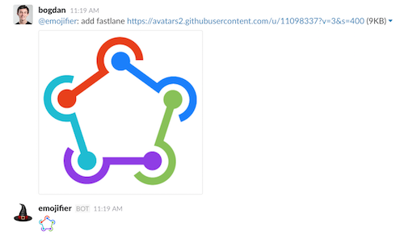

# Emojifier Slack bot 

A bot that lets you add custom Slack emoji by URL.

### How it works

In Slack: `@emojifier add <emoji name> <image url>`

- downloads image and resizes it to aspect fit within 128px x 128px.
- navigates Slack with [PhantomJS](http://phantomjs.org) (because the Slack API doesn't allow adding emoji)
- signs into Slack using Google Account or email & password (if you're using two step verification, [use an application specific password](https://support.google.com/accounts/answer/185833))

### Running Locally

`bundle install`

The following environment variables are required:

- `SLACK_API_TOKEN`
- `SLACK_TEAM_URL`

If using Google OAuth:

- `GOOGLE_ACCOUNT_EMAIL`
- `GOOGLE_ACCOUNT_PASSWORD`

If using email + password:

- `ACCOUNT_EMAIL`
- `ACCOUNT_PASSWORD`

you can put them in a `.env` file and run

`dotenv bundle exec rackup`

or otherwise just

`bundle exec rackup`
